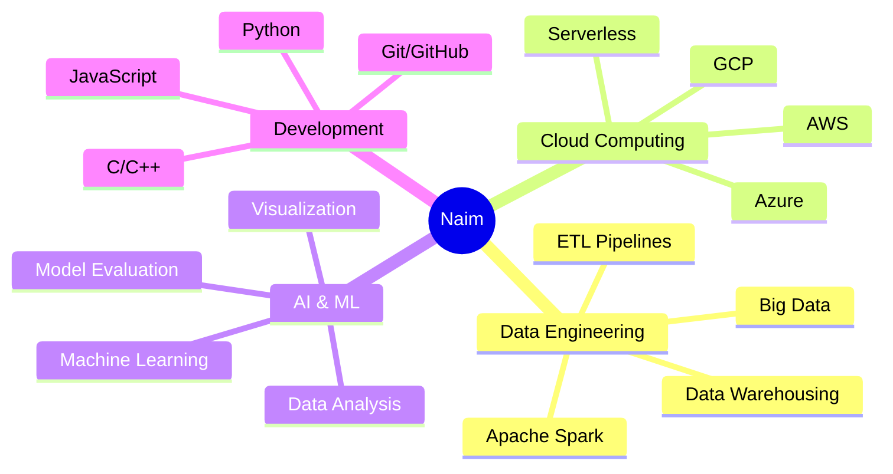

@@ -1,51 +1,200 @@
<h1 align="center">Hi 👋, I'm Naim</h1>
<h3 align="center">Engineer • Innovator • Dreamer ✨</h3>
<div align="center">
  
# 👋 Salut, je suis Naim Fertas

### 🚀 Data Engineer | Cloud Enthusiast | AI Innovator

[](https://git.io/typing-svg)

[](https://github.com/ni3ma-fer)
[](https://github.com/ni3ma-fer?tab=followers)

</div>

---

## 👨‍💻 About Me
- 🔭 I’m currently working on **Data Projects**  
- 🌱 I’m currently learning **AWS, Azure, Cloud Computing**  
- 🎯 Goal: Become a **Data Engineer / AI Specialist**  
- 📄 Know about my experiences [My Resume](https://flowcv.com/resume/0s5t9jf1l6lt)  
- ⚡ Fun fact: **🤖 I started teaching AI to solve problems… now I’m teaching myself to solve AI’s problems.**
## 🎯 À propos de moi

```python
class DataEngineer:
    def __init__(self):
        self.name = "Naim Fertas"
        self.role = "Data Engineer & AI Specialist"
        self.location = "🌍 Monde"
        self.currently_learning = ["AWS", "Azure", "Cloud Computing", "Big Data"]
        self.current_focus = "Building scalable data pipelines & AI solutions"
        
    def say_hi(self):
        print("Merci de visiter mon profil! N'hésitez pas à me contacter 😊")

me = DataEngineer()
me.say_hi()
```

- 🔭 **Actuellement :** Travail sur des **projets Data & AI**
- 🌱 **En apprentissage :** AWS, Azure, Cloud Computing, Apache Spark
- 🎯 **Objectif :** Devenir un **Data Engineer / AI Specialist** de référence
- 💡 **Fun fact :** 🤖 *J'ai commencé par enseigner à l'IA comment résoudre des problèmes... maintenant j'apprends à résoudre les problèmes de l'IA !*
- 📄 **Mon CV :** [Consultez mon parcours](https://flowcv.com/resume/0s5t9jf1l6lt)

---

## 📬 Contact Me  
💡 *I'm always open to discussing new projects, creative ideas, or opportunities to be part of your visions.*  
## 🛠️ Stack Technique

<div align="center">

Feel free to reach out through:  
- 📧 Email: **ni3mafer@gmail.com**  
- 💼 LinkedIn: [www.linkedin.com/in/naim-fertas-83727019b](https://www.linkedin.com/in/naim-fertas-83727019b)  
### ☁️ Cloud & Infrastructure


### 💻 Langages de Programmation


### 📊 Data & AI


### 🗄️ Bases de Données


### 🔧 Outils & DevOps


</div>

---

## 🛠️ Languages and Tools
<p align="left">
  <!-- Cloud -->
  <a href="https://aws.amazon.com" target="_blank" rel="noreferrer"></a>
  <a href="https://azure.microsoft.com/en-in/" target="_blank" rel="noreferrer"></a>
  <a href="https://cloud.google.com" target="_blank" rel="noreferrer"></a>
  
  <!-- Programming -->
  <a href="https://www.python.org" target="_blank" rel="noreferrer"></a>
  <a href="https://developer.mozilla.org/en-US/docs/Web/JavaScript" target="_blank" rel="noreferrer"></a>
  <a href="https://www.cprogramming.com/" target="_blank" rel="noreferrer"></a>
  <a href="https://www.w3schools.com/cpp/" target="_blank" rel="noreferrer"></a>
  
  <!-- Data & AI -->
  <a href="https://jupyter.org/" target="_blank" rel="noreferrer"></a>
  <a href="https://numpy.org/" target="_blank" rel="noreferrer"></a>
  <a href="https://pandas.pydata.org/" target="_blank" rel="noreferrer"></a>
  <a href="https://spark.apache.org/" target="_blank" rel="noreferrer"></a>
## 📊 Statistiques GitHub

<div align="center">

  <!-- Tools -->
  <a href="https://git-scm.com/" target="_blank" rel="noreferrer"></a>
  <a href="https://www.docker.com/" target="_blank" rel="noreferrer"></a>
  <a href="https://www.linux.org/" target="_blank" rel="noreferrer"></a>
  <a href="https://www.mysql.com/" target="_blank" rel="noreferrer"></a>
</p>


</div>

---

## 🚀 Projets Phares

<div align="center">

[](https://github.com/ni3ma-fer/AI-model-evaluator)

[](https://github.com/ni3ma-fer/NO_sql)

</div>

### 🔥 Projets Notables

| Projet | Description | Technologies |
|--------|-------------|--------------|
| **AI Model Evaluator** | 🤖 Plateforme de comparaison et évaluation de modèles d'IA avec visualisations interactives | Python, Jupyter, Data Viz |
| **NoSQL Restaurant Manager** | 🍽️ Système de gestion complet pour restaurants et livraisons avec MongoDB | MongoDB, Node.js, NoSQL |
| **PROJET_nosql** | 📊 Architecture de données distribuées pour gestion de services | MongoDB, JavaScript |

---

## 💼 Expérience & Compétences

<div align="center">



</div>

---

## 🏆 Réalisations

<div align="center">


</div>

---

## 📈 Contribution Activity

<div align="center">


</div>

---

## 📬 Me Contacter

<div align="center">

💡 *Je suis toujours ouvert aux discussions sur de nouveaux projets, des idées créatives ou des opportunités de collaboration !*

[](mailto:ni3mafer@gmail.com)
[](https://www.linkedin.com/in/naim-fertas-83727019b)
[](https://github.com/ni3ma-fer)

</div>

---

## 💭 Citation du Jour

<div align="center">


</div>

---

<div align="center">

### ⚡ "The only way to do great work is to love what you do" - Steve Jobs


**Merci pour votre visite !** 🚀


</div>
